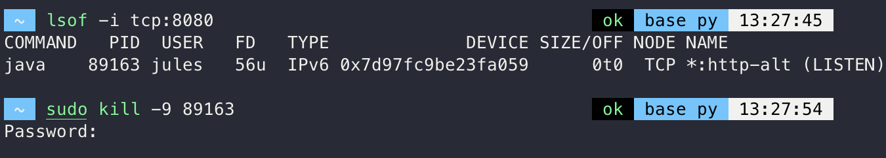

_김영한 Spring 입문 week-01_

# Welcome Page 만들기

_도메인만 누르고 들어왔을 때 첫 화면_

`resources/static/index.html` 를 생성합니다

resources/static/에 html 파일을 올려두면 

스프링 부트가 Welcome page 기능을 제공합니다

이는 파일을 그대로 던지는 형식으로,

다음의 템플릿 엔진이라는 것을 사용해 내용을 가공할 수 있습니다

# thymeleaf 템플릿 엔진

- [thymeleaf 공식 사이트](https://www.thymeleaf.org/)

- [스프링 공식 튜토리얼](https://spring.io/guides/gs/serving-web-content/)

- [스프링부트 메뉴얼](https://docs.spring.io/spring-boot/docs/2.3.1.RELEASE/reference/html/spring-boot-features.html#boot-features-spring-mvc-template-engines)

thymeleaf 템플릿 엔진을 통해 가공된 값을 web에 전달할 수 있습니다

```java
    @Controller
    public class HelloController {
      @GetMapping("hello")
      public String hello(Model model) {
          model.addAttribute("data", "hello!!");
          return "hello";
      }
}
```

`resources/templates` 에 위 메서드의 반환 값을 이름으로 하는 파일을 생성합니다

```java
<!DOCTYPE HTML>
  <html xmlns:th="http://www.thymeleaf.org">
  <head>
      <title>Hello</title>
      <meta http-equiv="Content-Type" content="text/html; charset=UTF-8" />
  </head>
<body>
<p th:text="'안녕하세요. ' + ${data}" >안녕하세요. 손님</p>
  </body>
  </html>
```

_resources/templates/hello.html_

thymeleaf를 의미하는 th를 적어 해당 공식을 적용시킵니다

동작 방식은 다음과 같습니다

1. 웹브라우저가 localhost:8080/hello 를 내장 톰켓 서버에 전달
2. 내장 톰켓 서버가 스프링에 전달
3. controller에 hello 맵핑이 있는지 확인
    _@GetMapping("/hello")_
4. 있다면 spring이 Model 객체를 만들어 메서드를 실행
5. viewResolver 가 화면을 찾아 처리
    _`resources:templates` + {return} + .html_


# spring이 생성한 Model 객체

Model은 view에 데이터를 전달하기 위한 객체입니다

Model은 HashMap 형태를 갖고 있으며, key, value 값을 가집니다

Controller의 메서드는 Model 타입의 객체를 파라미터로 받을 수 있습니다

view에 기본 자료형을 전달하기 위해서는 model 객체를 활용해야합니다

기본자료형을 매개변수로 선언하면 화면에 자동으로 전달되지 않습니다

1. 파라미터에 Model 타입의 객체를 선언
2. addAttribute()를 통해 전달

---

파라미터로 전달된 데이터를 다시 화면에 사용해야할 경우 

`@ModelAttribute`를 사용합니다

기본자료형인 파라미터 앞에 붙여 씁니다

```java
@GetMapping("/test")
public String testMethod2(TestVO vo, @ModelAttribute("number") int number) {
	
	return "/test";
}
```

# 정적 컨텐츠

정적 컨텐츠 방식은 고객에게 그대로 파일을 전달하는 방식입니다


`resources/static/` 에 static.html을 생성한 후

localhost:8080/static.html 을 주소창에 입력하면

html 그대로 화면에 띄워집니다

간단한 원리는 다음과 같습니다

1. 웹 브라우저에서 localhost:8080/hello-static.html 을 치면
2. 내장 톰켓 서버가 요청을 받고 스프링에 넘기면
3. 먼저 controller에서 hello-static 을 찾아보고 없으면
4. resources/static/에서 찾는다
5. 있으면 web에 그대로 반환

# MVC와 템플릿 엔진

mvc와 템플릿 엔진을 활용해 변형된 html을 전달하는 방식입니다

외부에서 인자를 받아 그 값을 적용해 출력할 수 있습니다

외부에서 이자를 받고 싶을 때 `@RequestParam`를 사용합니다

```java
GetMapping("hello-mvc")
public String helloMvc(@RequestParam("name") String name, Model model) {
        model.addAttribute("name", name);
        return "hello-template";
    }
```

간단한 원리는 다음과 같습니다

1. 웹 브라우저에서 주소 값을 넘기면
2. 내장 톰켓 서버가 이를 받아 스프링에 던지고
3. spring 은 controller 에 맵핑된 메서드를 찾아 호출
4. 리턴과 모델을 확인하고
5. spring 은 viewResolver 가 template/ 에서 호출 메서드의 리턴 이름과 동일한 파일을 찾아서
6. thymeleaf 템플릿 엔젠에게 넘겨 처리를 요청
7. 랜더링을 거쳐 변환된 html 이 웹브라우저에 반환

# API

서버간의 교류에는 화면을 띄울 필요가 없습니다

viewResolver 이 아닌,

HttpMessageConverter 를 통해 view 없이 그대로 반환합니다

@ResponseBody 어노테이션을 통해 HttpMessageConverter가 동작하고

body 부에 리턴 값을 그대로 넣어줍니다

```java
@GetMapping("hello-string")
@ResponseBody
public String helloString(@RequestParam("name") String name) {
        return "hello " + name;
    }
```

위의 예시는 문자가 전달되었지만 보통 객체가 전달됩니다

```java
    @GetMapping("hello-api")
    @ResponseBody
    public Hello helloApi(@RequestParam("name") String name) {
        Hello hello = new Hello();
        hello.setName(name);
        return hello;
    }
    static class Hello {
        private String name;

        public String getName() {
            return name;
        }

        public void setName(String name) {
            this.name = name;
        }
    }
```
간단한 원리는 다음과 같습니다

1. 웹 브라우저에서 localhost:8080/hello-api 를 치면
2. 내장 톰켓 서버에서 spring 에 전달하고
3. controller 에 맵핑된 hello-api 메서드를 찾고
4. responseBody 어노테이션을 확인하면 viewResolver 가 아닌 HttpMessageConverter 를 사용
5. 문자이냐 객체이냐 경우의 수에서
6. 문자가 오면 hello-string 처럼 그냥 문자값을 http 응답에 바로 넣어서 전달 `StringConverter`
7. 객체가 오면 JSON 방식으로 데이터를 만들어 http 응답에 전달 {name: spring} `JsonConverter`
    _대표적으로 MappingJackson2HttpMessageConverter_


_view가 필요 없으니 static 이나 mvc 처럼 html이 필요하지 않습니다_

# issue


## 문제점 1

인텔리제이에서 서버를 실행 - 종료 하는 것과 다르게

터미널에서 서버 실행 후 ctrl + c 강제종료를 시켰더니

이후 서버 재실행하는 과정에서 이미 서버를 사용하고 있다는 에러 메시지를 만났습니다

```
Web server failed to start. Port 8080 was already in use.
```

이에 대해 터미널에서 서버를 제대로 종료시키기 위한 방법이 궁금했습니다


## 해결방법

Mac

터미널에서 lsof -i tcp:8080 을 실행하면 8080포트로 실행중인 프로세스가 출력됩니다

8080포트로 실행중인 PID 번호와 sudo kill -9 {PID번호} 명령어로 해당 프로세스를 종료 시킬 수 있습니다



```
sudo kill -9 89163
```


# Reference

- [inflearn김영한 Spring 입문](https://www.inflearn.com/course/스프링-입문-스프링부트/dashboard)
- [Model 객체](https://velog.io/@msriver/Spring-Model-%EA%B0%9D%EC%B2%B4)


