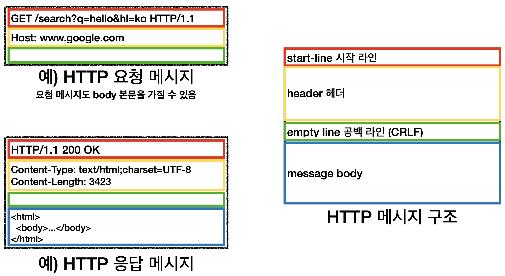

김영한님의 HTTP - 섹션 3 강의에 대한 내용입니다

# 모든 것이 HTTP

 HyperText Transfer Protocol

 HyperText
  
-> 문서간의 링크를 통해 연결할 수 있는 문서

이미지, 음성, 영상 등 모든 것이 HTTP 메시지에 담겨 전송되고 있다

기반 프로토콜로 HTTP1.1, 2 는 TCP, HTTP3는 UDP 기반으로 개발 되어있다

주로 사용되는 HTTP 1.1 에 집중 해보자

## HTTP 특징

1. **클라이언트 서버 구조를 가진다**

Request Response 구조

클라이언트는 서버에 요청을 보내고, 

응답을 대기 서버가 요청에 대한 결과를 만들어서 응답한다

클라이언트와 서버를 분리하는 것이 중요하다

비즈니스 로직과 데이터는 서버에 넣는다

클라이언트는 UI와 사용성을 넣는다

클라이언트와 서버가 각각 독립적으로 진화할 수 있다

2. **무상태 프로토콜**

서버가 클라이언트의 상태를 보존X 

- 상태를 보존하는 경우(Stateful)

    서버가 클라이언트의 이전 상태를 보존 하는 것

    `노트북` 얼만가요? -> 100만원 입니다

    `2개` 구매할게요 -> 네 200만원 되겠습니다
    (`노트북` 상태 유지)

    그런데 점원이 중간에 바꾼다면?

    `노트북` 얼만가요? -> 100만원 입니다

    `2개` 구매할게요 -> 무엇을 두개 구매 하시겠습니까?

    > 항상 같은 서버(점원)이 유지되어야 한다

- 상태를 보존하지 않는 경우(Stateless)

    `노트북` 얼만가요? -> 100만원 입니다

    `노트북 2개` 구매할게요 -> 무엇을 두개 구매 하시겠습니까?

    그런데 점원이 중간에 바뀌더라도!

    `노트북` 얼만가요? -> 100만원 입니다

    `노트북 2개` 구매할게요 -> 무엇을 두개 구매 하시겠습니까?

    > 중간에 점원이 바껴도 아무 문제 없다

    -> 확장성! 갑자기 고객이 증가해도 점원 즉 무한 서버 증설이 가능

- 장점: 서버 확장성 높음(스케일 아웃) 

- 단점: 클라이언트가 추가 데이터 전송(데이터를 너무 많이 보낸다)

    `노트북` `2개` 주세요

    실무 한계

    - 로그인이 필요한 경우

        로그인 했다는 상태를 서버에 유지

        일반적으로 브라우저 쿠키에 서버 세션등을 사용해서 상태 유지

        상태 유지는 `최소한만` 사용

3. **비연결성**

    기본적으로 클라이언트와 서버는 TCP/IP 연결을 유지한다

    클라이언트 2가 요청을 하면 이전에 연결된 클라이언트는 여전히 서버와 연결되어 있다

    클라이언트가 요청하지 않아도 서버와 연결되면 서버의 자원을 소모하게 된다

    비연결성은 요청, 응답하고 연결을 끊는다

    서버 입장에서 자원을 최소한으로 사용할 수 있다

- 장점

    HTTP는 기본이 연결을 유지하지 않는 모델로,
    
    일반적으로 초 단위의 이하의 빠른 속도로 응답한다

    1시간 동안 수천명이 서비스를 사용해도 실제 서버에서 동시에 처리하는 요청은 수십개 이하로 매우 작다

    예) 웹 브라우저에서 계속 연속해서 검색 버튼을 누르지는 않는다
    
    서버 자원을 매우 효율적으로 사용할 수 있다

- 한계와 극복

    TCP/IP 연결을 새로 맺어야 한다 (3 way handshake 시간 추가된다)

    사용자 입장에서 느려질 수 있다

    웹 브라우저로 사이트를 요청하면 HTML 뿐만 아니라 자바스크립트, css, 추가 이미지 등등 수 많은 자원이 함께 다운로드된다

    지금은 HTTP 지속 연결(Persistent Connections)로 문제를 해결한다

    HTTP/2, HTTP/3에서 더 많은 최적화 되었다

4. **HTTP 메세지**

    HTTP 메세지에 모든 것을 담을 수 있다

    

### 시작 라인

- 요청 매세지(request-line)

    시작 라인은 request-line 과 status-line으로 구성되는데

    request-line에는

    - HTTP 메서드 (GET: 조회)

    GET: 리소스 조회(리소스를 달라)
    
    POST: 요청 조회(데이터를 줄테니 처리해달라)

    - 요청 대상 (/search?q=hello&hl=ko) 

    absolute-path[?query] (절대경로[?쿼리]) 
    
    절대경로= "/" 로 시작하는 경로

    참고: *, http://...?x=y 와 같이 다른 유형의 경로지정 방법도 있다
    
    - HTTP Version

    가 들어간다

- 응답 매세지(status-line)

    HTTP 버전

    HTTP 상태 코드: 요청 성공, 실패를 나타냄

    - 200: 성공

    - 400: 클라이언트 요청 오류 500: 서버 내부 오류

    - 500: 서버 내부 오류

    이유 문구: 사람이 이해하도록 설명 글

### HTTP 헤더

HTTP 전송에 필요한 모든 부가정보가 들어있다

### 메세지 바디

실제 전송할 데이터가 들어있다

모든 데이터 전송이 가능하다

5. 단순하고 확장 가능하다

    HTTP는 단순하다.

    HTTP 메시지도 매우 단순

    크게 성공하는 표준 기술은 단순하지만 확장 가능한 기술

### 정리

- HTTP 메시지에 모든 것을 전송
- HTTP 역사 HTTP/1.1을 기준으로 학습 - 클라이언트 서버 구조
- 무상태 프로토콜(스테이스리스)
- HTTP 메시지
- 단순함, 확장 가능
- **지금은 HTTP 시대**
