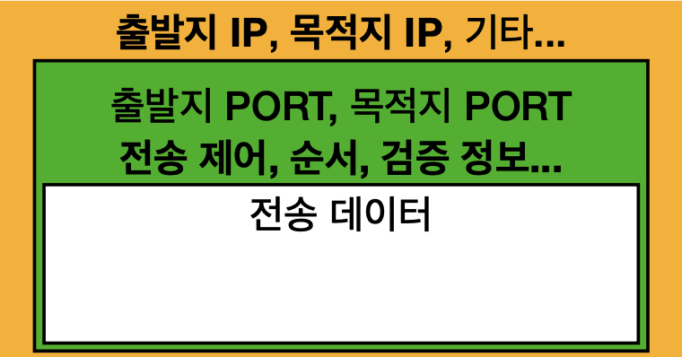
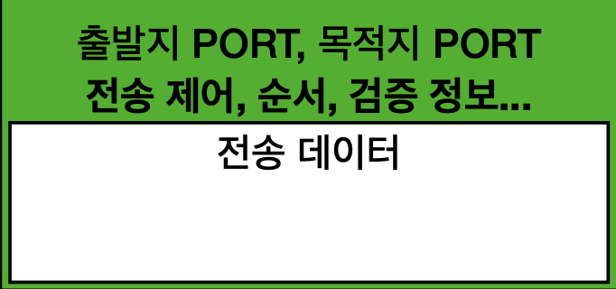
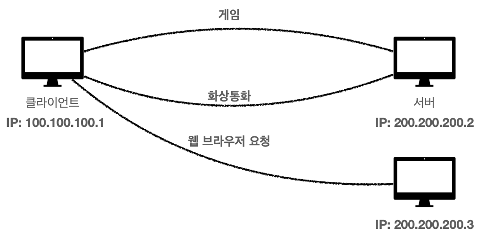
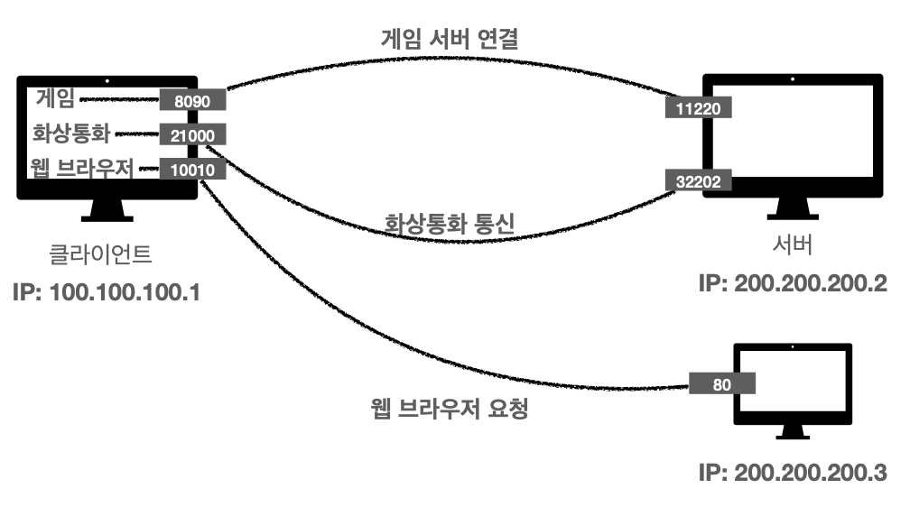

김영한님의 HTTP - 섹션 1 강의에 대한 내용입니다

# Internet Network

인터넷에서 컴퓨터 둘은 어떻게 통신할까?

- [Internet Network](#internet-network)
- [IP](#ip)
  - [IP 프로토콜의 한계](#ip-프로토콜의-한계)
- [TCP / UDP](#tcp--udp)
  - [TCP 특징](#tcp-특징)
  - [UDP 특징](#udp-특징)
- [PORT](#port)
- [DNS](#dns)

# IP

인터넷 프로토콜

각각의 컴퓨터에 IP 주소가 할당되어있다

주소가 있으니 데이터를 전달할 수 있다

- 지정한 IP 주소에 데이터를 전달
- 패킷 이라는 통신 단위로 데이터를 전달

인터넷 망의 노드들을 거치며 데이터가 목적지 IP에 도달하게 된다

IP 패킷은 정보를 출발지 IP, 목적지 IP 등을 적고 패키징하는 것을 말한다

## IP 프로토콜의 한계

비연결성

- 패킷을 받을 대상이 없거나 서비스 불능 상태여도 패킷이 전송됨

비신뢰성

- 중간에 패킷이 사라지거나
- 패킷이 순서대로 도착하는 것을 보장하지 않음

프로그램 구분

- 같은 IP를 사용해서 서버에 통신하는 애플리케이션이 둘 이상일 경우

출발 클라이언트에서 대상 서버가 패킷을 받을 수 있는 상태인지를 모른다

이를 보완하는 것이 바로 `TCP`

# TCP / UDP

인터넷 프로토콜 스택은 총 4계층을 가진다

_김영한님 HTTP - 인터넷 네트워크 강의 자료_

친구에게 메세지가 전달되는 과정을 서술하면 다음과 같다

채팅에 '안녕하세요' 라고 입력하면

- 애플리케이션

    소켓 라이브러리를 통해 OS 계층에다가 '안녕하세요' 메세지를 넘긴다

- OS

    '안녕하세요' 메세지에 TCP 정보를 씌운다(TCP 정보 생성)

    

    _김영한님 HTTP - 인터넷 네트워크 강의 자료_

    IP와 관련된 데이터를 패킷한다 (IP 패킷 생성)

    

    _김영한님 HTTP - 인터넷 네트워크 강의 자료_

- 네트워크 인터페이스

    네트워크 인터페이스를 통해 LAN 카드를 통해 나갈 때

    Ethernet frame 이 포함되어 나가게 된다

> 패킷
>패키지(수하물) + 버킷(덩어리) 를 뜻한다

## TCP 특징

전송 제어 프로토콜

1. 연결 지향

- 연결의 유무를 확인하고 메세지를 보낸다
- 3 way handshake

    SYN: 접속 요청

    ACK: 요청 수락

1. 데이터 전달 보증

    데이터를 전송하면 서버에서 데이터를 잘 받았는지 응답한다

2. 순서 보장

    순서가 잘못 전달되면 서버에서 잘못된 순서부터 다시 보내라고 응답한다

신뢰할 수 있는 프로토콜로 현재는 대부분 TCP를 사용한다

## UDP 특징

사용자 데이터그램 프로토콜

기능이 거의 없어 하얀 도화지에 비유한다

IP 에서 PORT가 추가된 것이다

하나의 IP에서 여러 애플리케이션을 사용할 때 도착지 애플리케이션에 잘 작동하도록 하는 것이 PORT 이다

TCP는 여러 응답을 하다보니 속도가 늦을 수 있다

사용자가 최적화 하고 싶을 때 UDP를 사용한다

# PORT

항구

한번에 둘 이상 연결해야할 경우

_김영한님 HTTP - 인터넷 네트워크 강의 자료_

IP 는 목적지 서버를 찾는 것을 말하고(아파트)

PORT 는 서버 내 돌아가는 애플리케이션을 구분하는 것을 말한다(00동 00호)

_김영한님 HTTP - 인터넷 네트워크 강의 자료_

- 0 ~ 65535 할당이 가능
- 0 ~ 1023 잘 알려진 포트(사용 지양)

# DNS

IP 는 기억하기가 어렵다

200.200.200.2 ...

IP 는 변경될 수 있다

도메인 네임 시스템은 전화번호부 같은 서버(DNS 서버)를 제공한다

도메인 명을 IP 주소로 변환할 수 있다

나중에 IP가 바뀌더라도 도메인 명만 알고 있으면 IP 주소를 얻을 수 있다
