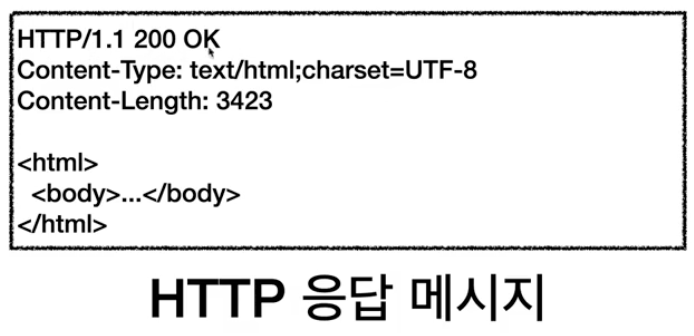

김영한님의 HTTP - 섹션 2 강의에 대한 내용입니다

# URI

Uniform Resource Identifier

리소스를 식별하는 통합된 방법

URI는 로케이터(locator), 이름(name) 또는 둘 다 추가로 분류될 수 있다


_김영한님 HTTP - URI와 웹 브라우저 요청 흐름 강의 자료_

- L : 리소스의 위치
- N : 리소스의 이름

## URI

- Uniform: 리소스 식별하는 통일된 방식
- Resource: 자원, URI로 식별할 수 있는 모든 것(제한 없음)

    파일만 자원이 아니다

    구분할 수 있는 모든 것을 말한다

- Identifier: 다른 항목과 구분하는데 필요한 정보

- URL: Uniform Resource Locator 
- URN: Uniform Resource Name

## URI 분석

https://www.google.com/search?q=hello&hl=ko

## URL 전체 문법

- scheme://[userinfo@]host[:port][/path][?query][#fragment] 
- https://www.google.com:443/search?q=hello&hl=ko

- 프로토콜(https) 
- 호스트명(www.google.com) 
- 포트 번호(443)
- 패스(/search)
- 쿼리 파라미터(q=hello&hl=ko)

1. scheme

- 주로 프로토콜 사용
- 프로토콜: 어떤 방식으로 자원에 접근할 것인가 하는 약속 규칙

    예) http, https, ftp 등등

- http는 80 포트, https는 443 포트를 주로 사용, 포트는 생략 가능
- https는 http에 보안 추가 (HTTP Secure)

> https

2. userinfo

- URL에 사용자정보를 포함해서 인증
- 거의 사용하지 않음

3. host

- 호스트명
- 도메인명 또는 IP 주소를 직접 사용가능

> www.google.com


4. PORT


- 접속 포트
- 일반적으로 생략, 생략시 http는 80, https는 443

5. PATH

- 리소스 경로(path), 계층적 구조 예)

    예)

    /home/file1.jpg
    
    /members
    
    /members/100, /items/iphone12

6. QUERY

- key=value 형태
- ?로 시작, &로 추가 가능 ?keyA=valueA&keyB=valueB
- query parameter, query string 등으로 불림, 웹서버에 제공하는 파라미터, 문자 형태

7. FRAGMENT

- html 내부 북마크 등에 사용
- 서버에 전송하는 정보는 아님

# 웹 브라우저의 요청 흐름

내가 주소창에 

https://www.google.com:443/search?q=hello&hl=ko

를 입력한다면?

먼저, DNS 서버를 조회해 IP, PORT 값을 찾는다

```
www.google.com - > 200.200.200.2(ip)

https -> 443(port)
```

애플리케이션에서 웹 브라우저가 HTTP 요청 메세지를 생성한다


소켓 라이브러리를 통해 OS 에다가 TCP/IP 계층에 전달해야한다

방법은

조회해서 얻은 IP와 PORT를 3 세이크핸드를 통해 TCP/IP 연결하고

데이터를 전달한다

TCP/IP 에서 HTTP 메서지에 패킷을 씌우고 인터넷 망으로 던져 노드를 통해 구글 서버에 도착을 한다

구글 서버는 HTTP 메세지를 해석하여 HTTP 응답 메세지를 만들어 클라이언트 서버에 전달한다



클라이언트가 이 메서지를 받아 HTML 랜더링하면 우리가 보는 결과 화면을 보게 된다
